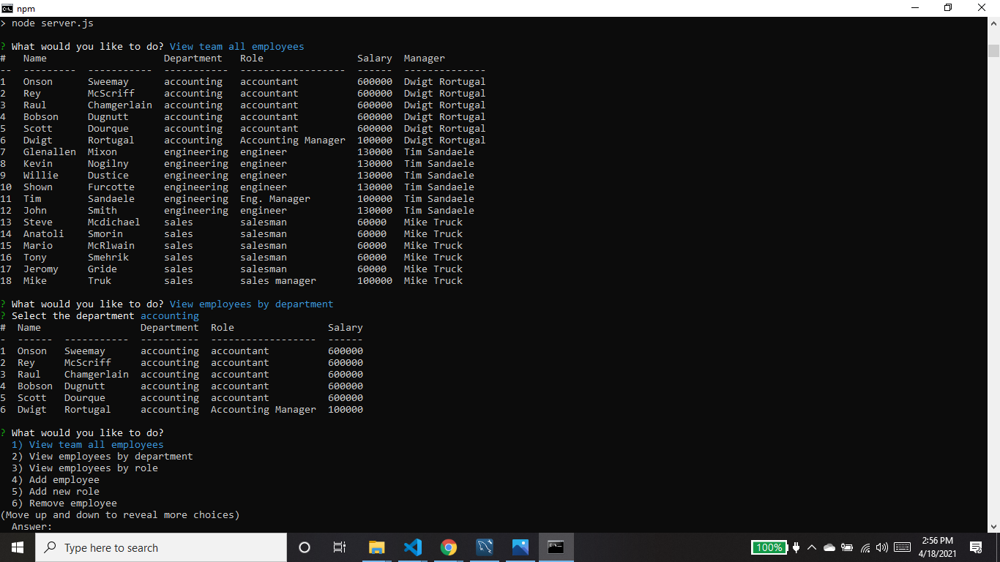

# round_the_databases 
   
  ===========================================
    
  ## Description 
      This is a Content Management System intended to help view and alter database information.  Using this interface, employers can view employee information and update it as needed.
  ## Table of Contents 
  - [Installation](#installation)
  - [Usage](#usage)
  - [Contributions](#contributions)
  - [Questions](#questions)
  - [License](#license)
  ## Installation 
      Install Inquirer package using npm install in the command line.
  ## Usage 
      Invoke npm start while in the directory with the repository for this app. The prompts will direct the user and display tables and alert the user to actions that are performed successfully.  Below is a screenshot of the app with an added manager column which was missing in the video that follows.

View this [video](https://drive.google.com/file/d/1aVz3GZmt56rFoak56RycLBQXNnFBxXli/view) as an example. 

  ## Contributions 
This was created by:
* kellyjohnson364: [https://github.com/kellyjohnson364](https://github.com/kellyjohnson364)
            
            
            
Please feel free to contribute to this project.
           

## Questions 
If you have questions or feedback, please contact kellyjohnson364 at [https://github.com/kellyjohnson364](https://github.com/kellyjohnson364) or via email at kj3641402@gmail.com.

## License
This project is licensed under The Unlicense.
For more info click [The Unlicense](./assets/licenses/theunlicense.md).